*本文是云原生开放协同技术探索与实践一阶段的总结和综述。*

蚂蚁基础技术在过去3年多以来持续、深入推进全面的云原生化技术演进，我们将在线、离线计算资源装进了一台计算机，将服务体系通过 mesh 的思路和技术手段进行了下沉解耦，可以说比较充分的拥抱了云原生技术，并获取了其带来的技术红利。

当完成了资源、服务的云原生化，我们发现在云原生基础能力之上的运维体系与云原生技术开放、共享的思路有较大的距离，在技术体系上也与云原生技术声明式、白盒化的思路相悖，同时由于缺少匹配的技术支撑，历史包袱等问题也成为了云原生运维难以真正代际演进的障碍。今天我要介绍的就是蚂蚁在这样的背景下在云原生运维方向进行的技术探索和实践。

## 1. 规模化云原生运维探索

我们先来回顾一下在蚂蚁真实的实践方式和面对的问题。首先，我们来看看蚂蚁践行多年的经典运维中台，这类运维平台一般包括了控制器、业务模型、编排引擎、原子任务及管道，在蚂蚁这样的平台是一系列服务的集合，他们较好的满足了集中式、标准化、低变更频率的应用发布及运维需求。但这种模式在实践中也存在着明显的不足。

首先对于非标准应用、应用个性化需求、高成本需求、非紧急需求、技改类需求，往往无法较好的满足。在蚂蚁的实践中，非标运维需求、对核心应用模型及运维模型冲击较大的高成本改造需求、大量基础能力或运维功能的透出需求等长期无法得到较好的满足，需求往往是合理的，是难以获得足够的优先级执行落地。在研发阶段，运维平台长期积累了高复杂度的业务逻辑，修改测试涉及跨系统的长改造链路，同时基础能力的透出、运维能力的产品化依赖前端、服务端研发资源。这些问题使得运维平台研发日渐吃力，特别是在产品 GUI、业务模型、编排引擎等变更热点上，受限于扩展机制能力不足，内部实践中甚至出现过线上不断修改代码、发布服务以满足需求的情况。平台上线后，统一的质保和线上全链路功能验证同样面对较大的压力。对于最终的使用者，命令式按钮背后的黑盒计算透明度低，审计难，结果难预测，同时激情操作、操作界面不熟悉等问题也一直影响着线上的稳定性。这些问题长期存在，我们寄希望于代际的技术演进来解决这些问题。

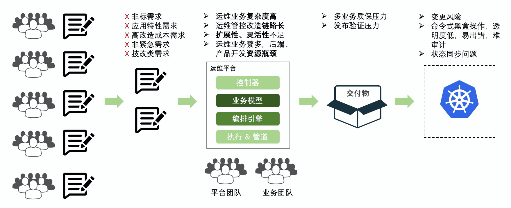

当云原生基础服务逐渐稳定后，对于自身场景不在运维平台管理范围内的应用，研发同学自发的借助云原生社区工具链解决问题。基于 Kubernetes 生态高度开放、高度可配置的特点，研发者可以自助、灵活、透明的声明式应用运行、运维需求，以应用粒度完成发布、运维操作。

用户通过 kustomize 等社区技术缩短了对接基础设施的路径，并通过如 velocity 等文本模板技术部分解决了静态 YAML 文件在较多变量时维度爆炸的问题，解决了默认值设定的问题，同时通过 code review 的方式进行多因子变更及评审。由于 Kubernetes 及其生态提供了面向资源、服务、运维、安全的横向能力，使得这种简单的方式可有很好的普遍性和适用性，通过对不同的 Kubernetes 集群 “播放” 这些数据即可完成对基础设施的变更，本质上是一种声明数据的流转。面向 git 仓库的研发方式和 gitops 流程支持对运维产品研发资源的诉求较低，往往可以比较简单的搭建起来，不强依赖产品研发资源投入。相比经典运维中台，这些好处清晰明确，但从工程视角缺点也非常明显。

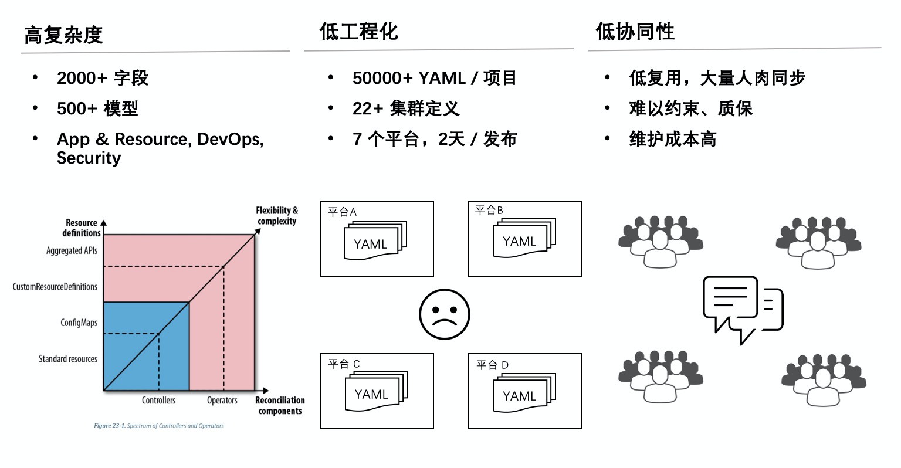

首先 Kubernetes API 的设计较为复杂，仅是 Kubernetes 原生提供的 low level API 就暴露了 500 多种模型，2000 多字段，场景上几乎涵盖了基础设施应用层的方方面面，即使是专业同学也很难理解所有细节。其次这种方式的工程化程度很低，违反 DRY 原则，违反各团队职责能力高内聚低耦合的原则，即使在有一定的工具支持的情况下，在内部的典型案例中一个多应用的 infra 项目仍然维护了多达 5 万多行 YAML，同时由于团队边界造成的多个割裂的平台，用户需在多个平台间切换，每个平台的操作方式各异，加上跳板机黑屏命令，完成一次完整的发布需要 2 天时间。

由于低工程化程度的问题，各团队间协同依赖人肉拉群同步，最终 YAML 由多个团队定义的部分组合而成，其中一大部分属于 Kubernetes 及运维平台团队的定义，这些内容需要持续跟踪同步避免腐化，长期维护成本高。

## 2. KUSION: 云原生开放协同技术栈

以上两种模式各有利弊，优势和问题都比较清晰。那么能不能既要也要呢，能不能在继承经典运维平台优势的情况下，充分利用云原生技术带来的红利，打造一个开放、透明、可协同的运维体系？

带着这样的问题，我们进行了探索和实践，并创建了基于基础设施代码化思路的云原生可编程技术栈 Kusion。

大家都知道 Kubernetes 提供了声明式的 low level API，提倡其上生态能力通过 CRD 扩展的方式定义并提供服务，整个生态遵循统一的 API 规范约束，复用 API 技术和工具。Kubernetes API 规范提倡 low level API 对象松耦合、可复用，以支持 high level API 由 low level API “组合” 而成。Kubernetes 自身提供了利于开源传播的极简方案，并不包括 API 之上的技术和方案。

回到云原生技术的本源，我们回看了 Kubernetes 前身 Borg 的应用技术生态。如下图示，在 BorgMaster 之上，Borg 团队研发了 Borg 接入三件套，即 BCL（Borg Configuration Language），Command-line tools，以及相应的 web service。用户可以通过 BCL 声明式编写需求，通过 Command-line tools 将 BCL 文件执行到 Borg 集群，并通过 web GUI 视图查看任务细节。经过大量的调研，我们了解到 Google 内部的运维能力及产品生态、质量技术生态都依赖这三件套构建而成，在内部也进行了多年的迭代演进。

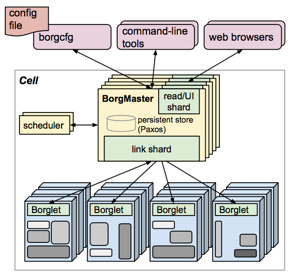

这给了我们启发，今天我们有了容器技术、服务体系，有了大量用户和差异化的需求，有了一定数量的自动化运维平台，我们希望能通过云原生专用的语言和工具来链接 Kubernetes 生态、各个运维平台以及大量的用户，通过唯一事实定义消除运维平台孤岛，完成云原生基础设施在应用、运维层面的代际演进，达到 “Fusion on Kubernetes” 的目标。

带着这样的目标，我们持续地进行做技术探索和实践，目前已经形成了 Kusion 技术栈，并在蚂蚁的生产实践中进行应用。

Kusion 技术栈基于这样的基础能力而工作，包括如下组成部分：

- 云原生配置策略专用语言 KCL (Kusion Configuration Language)
- KCL 解释器及其 Plugin 扩展机制
- KCL 研发工具集: Lint, Format, Doc-Gen，IDE Plugin(IDEA, VsCode)
- Kusion Kubernetes 生态工具: OpenAPI-tool, KusionCtl(Srv)
- Konfig 配置代码库，其中包括平台侧及用户侧代码
- OCMP (Open CloudNative Management Practice) 实践说明书

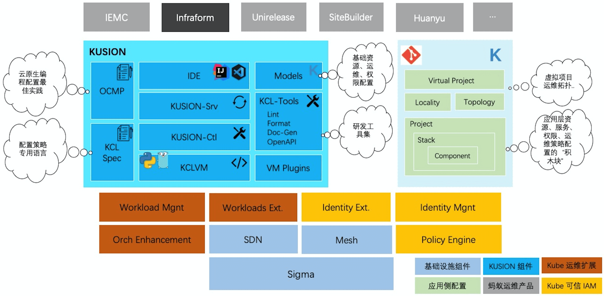

Kusion 工作在基础设施之上，作为抽象及管理层的技术支撑服务上层应用。不同角色的用户协同使用 Kubernetes 生态提供的横向能力，通过声明式、意图导向的定义方式使用基础设施，在场景上支持典型的云原生场景，也服务了一些经典运维场景，完成了一阶段的建设工作。目前接入 Kusion 的产品包括 IaC 发布、运维产品 InfraForm、建站产品 SiteBuilder、快恢平台等。通过将 Kusion 集成在自动化系统中，我们尽可能的调和黑盒命令式自动化系统与开放声明式配置系统，使其发挥各自的优势。

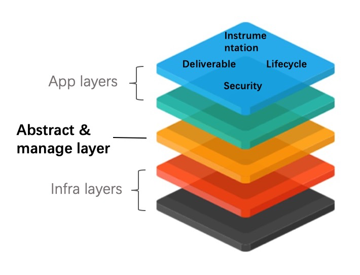

## 3. 集成 & 落地

新的技术体系首先面临着落地的问题，我们先来看看 Kusion 在集成落地方面的思考和做法。

从整体思路上，我们从经典运维系统中的变更热点业务层、编排层着手，以 KCL 声明式配置块的方式外置编写对应逻辑，并被控制器自动化集成。

这种思路是有迹可循的，我们来看看同行的经验，以雷神山医院的建设现场为例，我们可以看到现场大量的组件是预制品，经过了测试、验证、交付后由现场的塔吊负责组装。这些组件需要良好的品控，需要内置水管、电线等“能力”，否则即使组装也无法有效工作，同时需要给业务侧一定的自定义配置空间，还要易于组装及自动化以提升现场装配效率。实际上我们面对的大规模运维活动与这样的现场有类似之处，现代基建的高效手段非常值得我们学习借鉴。

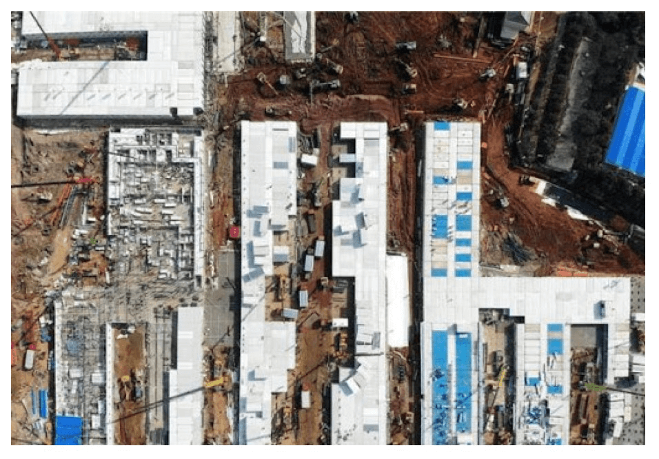

对应我们的实际场景，我们基于 KCL 的工作方式需要满足以下要求：

- **可分工、可协同：**组件制作、验收、交付、使用可以基于角色需要合理分工协同，满足软件供应链的需求
- **外置、预制的组件：**组件独立于自动化系统存在，预制的组件在交付前需要经过充分的测试验证
- **内置资源、服务、身份等要素：**组件仅向用户暴露有效的业务信息，同时内置云原生、可信的逻辑
- **易于业务定义：**组件需要提供一定的自定义配置能力
- **易于自动化：**支持自动化组装，自动化对组件进行“增删改查”

接下来，我们来看看基于 Kusion 工作的典型流程，此处有一定的抽象和简化。

前文提到 Kubernetes API 提供了基于 OpenAPI 的 low level API 及扩展机制，基于高内聚、低耦合、易复用、易组装的原则设计，以 Resource、Custome Resource 的方式存在。此外，Kubernetes API 提供了大量的命令以操作容器、Pod 等资源。对于 SDN、Mesh，或是其他的能力扩展都是基于这样的整体约束和方式，大都提供了资源定义或命令操作。

基于这样的基础，在蚂蚁的实践中我们将整体的工作流程分为 4 个步骤：

- **代码化:** 对于资源定义，基于 OpenAPI Model/CRD 定义生成 KCL 结构体；对于命令操作，编写对应的声明式 KCL 结构体。这些结构体对应到平台侧原子能力定义。
- **抽象化:** 平台侧 PaaS 平台同学基于这些原子声明式编写抽象、组装，并定义出面向用户的前端结构体，从功能场景上涵盖了 AppConfiguration, Action / Ops, Locality / Topology, SA / RBAC, Node / Quota 等场景，并提供了简化编写的 Template 集合。以 AppConfiguration 为例，我们提供了SigmaAppConfiguration、SigmaJobConfiguration 分别对应于服务型和任务型应用定义，此外针对 SOFA 应用的特征提供了 SofaAppConfiguration。这些前端结构体作为 Kusion Models 的“接口层”存在，受限于业务进度等原因各场景积累的水位不同，仍需要长期的积累打磨。
- **配置化:** 应用侧研发或 SRE 同学基于这些前端结构体描述应用需求。用户可以通过结构体声明的方式为应用定义配置基线及不同环境的配置。在大部分情况下，用户仅需要进行结构体声明，即一些 key-value 对。对于有复杂需求的场景，用户可以进行逻辑编写或通过继承结构体的方式组织代码逻辑
- **自动化:** 当应用侧配置完成后，实际上已经定义好了可用的“组件”，具备了自动化的条件。平台侧控制器可以通过 KCL CLI 或 GPL binding API 完成编译、执行、输出、代码修改、元素查询等自动化集成工作，用户则可以通过 KusionCtl 工具执行 KCL 代码映射执行到 Kubernetes 集群。

通过这样统一的工作流程，我们轻量级地完成了对 Kubernetes 生态大量基础能力的透出，基于原子能力声明式地封装、抽象出面向应用的配置、运维能力，并完成了一定场景的落地应用。Kusion 提供了研发工具协助使用者完成其工作。我们可以对平台侧、用户侧分层协同模式下的实践做进一步的探讨。平台侧同学抽象并定义出前端结构体，例如 SofaAppConfiguration ，其中定义了业务镜像、所需资源、config、secrect、sidecar、LB、DNS、副本数、逻辑资源池、发布策略、是否超卖、是否访问公网等等。

前端结构体无法独立工作，实际上存在着与前端结构体对应的后端结构体，后端对前端透明，前-后端结构体分离解耦。后端结构体在运行时将前端结构体产生的数据“翻译”成对应的 low level API ，这种反向依赖的方式依赖于 KCL 语言能力。

从工程角度看平台侧同学实际上完成了一次轻量级、声明式的应用级 API 定义。这种前后端分离的设计有诸多好处。首先应用侧使用的前端结构体可以保持简单干净、业务导向、实现细节无关；其次可以通过编译时指向不同的后端文件动态切换到不同的后端结构体实现，以完成平台版本切换、实现切换等目的；最后这样分离的做法可以在统一模式的前提下保证充分的灵活性，例如平台可以通过 kcl base.k prod.k backend.k 多文件编译完成一次包含基线、环境配置、后端结构体的组合编译。事实上，我们可以将所有场景规约为 kcl user_0.k … user_n.k platform_0.k … platform_n.k 的范式，其中 user.k 代表用户侧代码，platform.k 代表平台侧代码。我们从另一个角度来看多团队协同的方式。由各团队自下而上定义平台能力及约束，并完成应用级的配置基线及配置环境特征，完成最后一公里的定义。

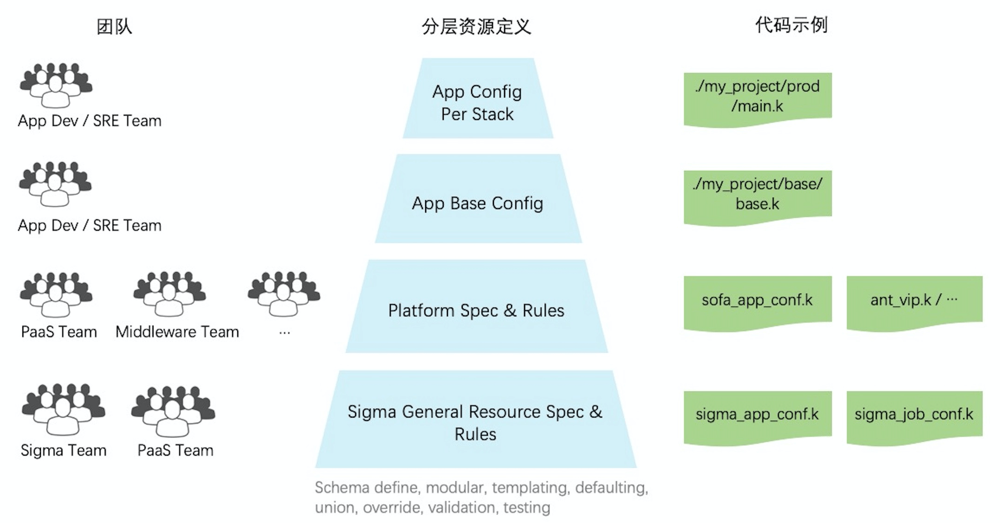

在理清工作流程后，我们来看 KCL 通过 Konfig 大库落地的实践。我们在 Konfig 代码仓库中定义了平台侧及用户侧的代码空间，通过统一配置代码库完成对代码的共享和复用，保证了对整体基础设施代码定义的可见性。在用户侧，通过 project、stack、component(对应蚂蚁内部应用) 三级目录的方式组织代码。以 cloudmesh 为例，在 tnt/middleware/cloudmesh 的 project 目录下含多个 stack，如 dev、prod，每个 stack 中含多个 component。代码在这三个维度得以隔离，并共享上下文。

在代码质保方面，我们通过单元测试、集成测试等手段保证对平台侧、用户侧代码的质量，我们正在引入代码扫描、配置回放、配置校验、dry-run 等验证手段保证代码变更的可靠性。在研发方面，我们通过主干开发、分支发布的方式保证不同应用并行研发的前提下尽可能不产生代码腐化的情况，并通过 tag 保护稳定分支。

在 IaC 产品落地场景中，通过标准化的结构体、代码版本化、多环境代码隔离、CI pipeline 等手段管理基础设施描述代码，通过代码变更的静态、动态 diff、模拟、异常提示、风险管控接入保证基础设施变更可控，通过代码 Pull Request 做变更审计及对变更人员的追踪。下图以业务发布场景为例展示了关键步骤，在业务代码通过质保流程并完成镜像构建后，CI 流程控制器通过 KCL API 对 Konfig 仓库中对应 KCL 文件中的 image 字段进行自动更新，并发起 Pull Request，由此触发发布流程。

IaC 提供了编译测试、live-diff、dry-run、风险管控接入等验证方式，并支持执行过程的可视化，产品基于 KCL 语言能力及工具建设，尽可能的减少业务定制。整个流程以 Konfig 代码的自动修改为起点，平台方、应用方、SRE 基于代码协同，通过产品界面进行线上发布，支持分批分步、回滚等运维能力。Konfig 中的代码“组件”可以被多个场景集成使用，例如此处被发布控制器集成的组件还可以被建站控制器集成，控制器只需关注自动化逻辑，无需关心被集成组件的内部细节。以文章开头的典型建站场景为例，在接入 Kusion 后，用户侧配置代码减少到 5.5%，用户面对的 4 个平台通过接入统一代码库而消减，在无其他异常的情况下交付时间从 2 天下降到 2 小时。

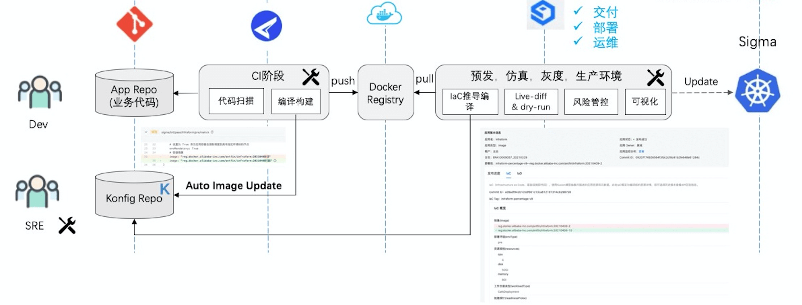

我们再来看更加动态性的大规模快速恢复场景。快恢平台在接到监控告警输入后决策产生异常容器 hostname 列表，并需要对容器进行重启等恢复操作。

我们通过 KCL 编写声明式的应用恢复运维代码，其中通过 KCL Plugin 扩展完成对在线 CMDB 的查询，将 hostname 列表转换为多集群 Pod 列表，并声明式定义 Pod 恢复操作。快恢平台执行 KusionCtl run AppRecovery.k 完成跨多集群的 Pod 恢复操作。通过这样的方式，快恢控制器无需理解容器恢复细节、Kubernetes 多集群映射执行细节等，可以更专注于自身异常判断及决策逻辑。

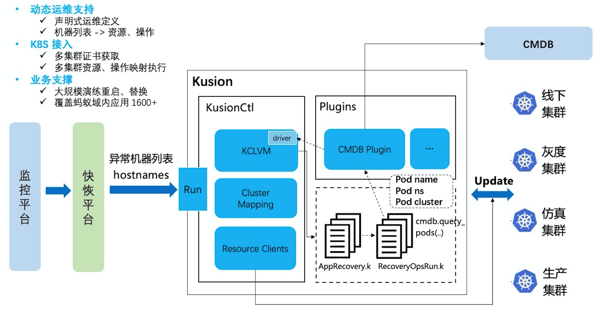

在项目落地过程中，我们也发现到了不少因为进度等原因造成的平台侧设计问题。例如平台侧操作定义不够规范，应用依赖等共性定义过于分散等问题，这需要我们在后续的落地过程中持续去沉淀提高。开放配置给了用户更大的灵活性和空间，但相比黑盒的方式需要更多的安全性保障。在开放协同推进的同时，可信原生技术部在并行推进云原生可信平台的建设，可信平台通过将身份与 Kubernetes 技术紧密结合提供相比社区方案能力更强的技术支撑。

举个例子，通过开放配置我们是不是可以通过 mount 证书的方式使得不可信不安全的服务获得访问目标服务的权限从而获取到关键数据？事实上在没有身份传递及高水位 Pod 安全保障的前提下这是完全可能。通过可信平台对 PSP（Pod Security Policy）、服务验证、服务鉴权等场景的加固，使得我们可以按需增强关键链路的安全策略。相比与社区方案，可信平台定义了更完整的 spiffe 身份标识，并使得身份作用于资源、网络、服务的各个环节，可以说可信是开放的必要前提。同时可信提供的鉴权能力、隔离能力也需要被用户使用，将原子能力封装并在应用配置层面透出依赖于 Kusion 的推进，使得接入 Kusion 的应用可以更简单的使用可信能力。可以说开放协同技术栈与可信平台是能力正交，相辅相成的云原生应用层技术。

**最后，我们对集成落地做一个小结：**

平台侧编写 80% 内容，通过面向应用的前端结构体提供规范的配置块，再通过后端结构体定义屏蔽 low level API 资源及操作，最终通过这样的方式描述应用对 workload、编排、运维等方面的需求，重点在于可以定义什么、默认有什么及约束集合，并通过 Konfig 仓库共享复用。平台侧趋向引擎化，专注自动化控制逻辑，由 KCL 代码作为扩展技术外置编写业务逻辑。我们希望面对复杂的运维业务诉求，平台侧控制器逐步演进到低频变更，甚至零变更。

应用侧输入 20% 内容，以平台侧前端结构体为界面声明应用侧诉求，重点在于要什么、要做什么，所写即所得。应用侧通过面向多项目、多租户、多环境、多应用的代码工程结构组织代码，通过 Pull Request 发起变更，通过 CICD pipeline 完成白盒化的线上变更。同时，应用侧有对单应用编译、测试、验证、模拟的自由度，在充分验证后交付使用；对多应用可通过 KCL 语言能力按需灵活组合。将大规模的复杂问题拆分缩小到应用粒度，得到充分验证后按需合并，本质上是一种分治思路的实践。针对蚂蚁的实际情况，我们通过 KusionCtl 工具支持研发测试环境的执行及可视化，通过 InfraForm 产品、SiteBuilder 产品等推动线上的部署过程。

## 4. 协同配置问题模型

理解了落地思路和场景实践方式，我们将进一步下钻拆解具体的协同场景，同时分析 KCL 语言在配置场景的设计和应用。

我们先来看平台侧编写轻量级应用级 API 的一些要点。平台侧同学可以通过单继承的方式扩展结构体，通过 mixin 机制定义结构体内属性的依赖关系及值内容，通过结构体内顺序无关的编写方式完成声明式的结构体定义，此外还支持如逻辑判断、默认值等常用功能。

对于声明式与命令式的差异做简单的分析，我们以斐波那契数列为例，可以把一组声明式代码看作一个方程组，方程式的编写顺序本质上不影响求解，而“求解”的过程由 KCL 解释器完成，这样可以避免大量命令式拼装过程及顺序判断代码，对于存在复杂依赖的结构体而言优化尤为明显。

对于复杂结构，命令式拼装的写法多出一倍以上的代码量，补丁代码使得结果难以预测，同时需要考虑执行顺序问题，特别是在模块化过程中调整存在依赖的模块顺序非常繁琐且易出错。对于各种配套能力，我们通过 mixin 机制编写，并通过 mixin 声明的方式“混入”到不同的结构体中。

对于平台侧来说，稳定性保证尤为重要。

当配置数据量逐步增大时，良构类型是保证编译时问题发现的有效手段，KCL spec 包括了完备的类型系统设计，我们正在实践静态类型检查和推导，逐步增强类型的完备性。

同时 KCL 引入了多种不可变手段，支持用户按需定义结构体内属性的不可变性。通过这两种基础而重要的技术手段使得大量违反编写约束的情况可以在编译时被检查发现。

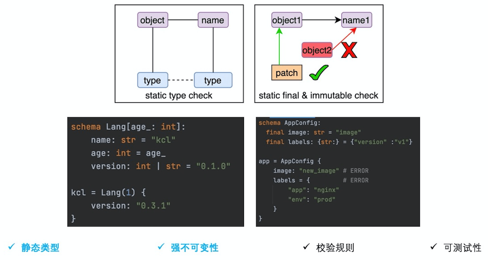

对于业务向的内容，KCL 支持通过结构体内置的校验规则及单元测试的方式支持。以下图所示代码为例，我们在 AppBase 中定义对 containerPort、services、volumes 的校验规则，同时在 MyProdApp 中定义叠加的环境相关的校验规则。目前校验规则在运行时执行判断，我们正在尝试通过编译时的静态分析对规则进行判断从而发现问题。

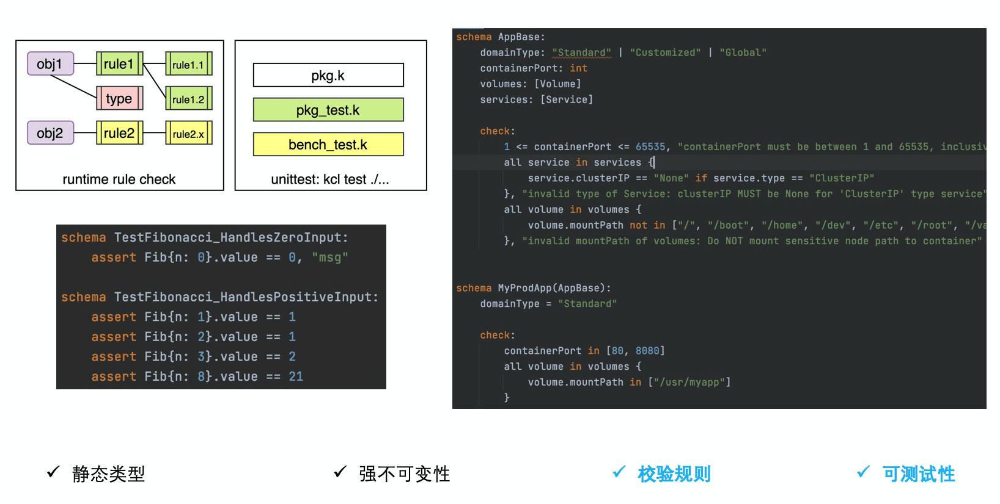

此外对于平台侧来说，升级推进是必须面对的问题。我们首先需要考虑最坏情况，即提供给用户的前端结构体需要做不兼容的调整，按照新增配置项并下线老配置项的思路，我们需要对待下线字段进行禁用，并以合理的方式告知用户。

当平台自身出现不兼容更新时问题相似，只是需要平台侧后端结构体进行调整，应用侧用户不直接感知。KCL 针对这类问题提供了字段禁用的功能，使用被禁用字段将在编译阶段通过警告或错误的方式提示，编译错误将 block 编译，从而迫使用户在编译阶段进行修改，避免将问题带入运行时造成影响。

对于兼容的平台侧调整，通常在后端结构体修改导入的原子定义文件即可。对于 KCL 解释器自身的变化，我们通过单元测试、集成测试、模糊测试等进行验证，对于 plugin 的变更通过 plugin 自身的测试验证。KCL 解释器及 plugin 的变化通过需要 Konfig 代码库的 UT、IT 进行测试验证，保障已有代码正常工作。在经过测试验证后，发起 Pull Request 通过 code review 评审。

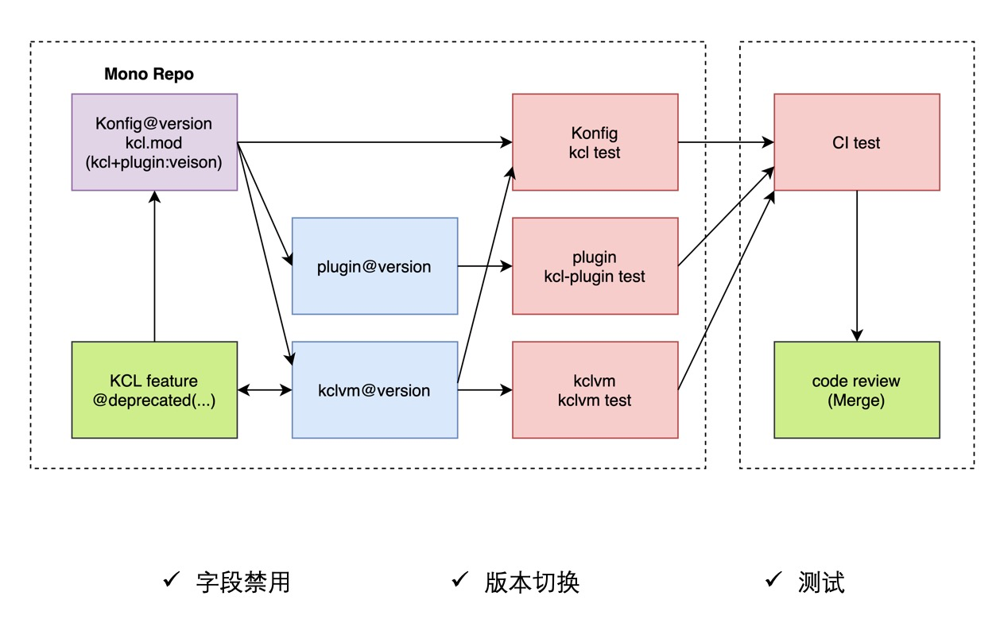

我们再来简单梳理应用侧协同的场景。假设存在基线配置及生产环境配置，在我们的实践中存在三种典型场景。

第一种场景中，基线与生产配置中各定义了同名配置的一部分，由 KCL 自动合并生成最终配置块，这适用于对称配置的场景非常有效，如果出现冲突则会进行冲突报错。

第二种场景中，我们希望在生产配置中覆盖基线配置中的一些配置项，类似 Kustomize 的 overlay 覆盖功能，事实上这是大多数熟悉 Kubernetes 使用者的诉求。

对于第三种场景，编写者希望配置块全局唯一，不能进行任何形式的修改，若出现同名配置则会在编译阶段报错。在真实的场景中，基线与各环境配置可由研发与 SRE 配合完成，也可以由 Dev 独立完成，Kusion 本身不限制使用者职能。

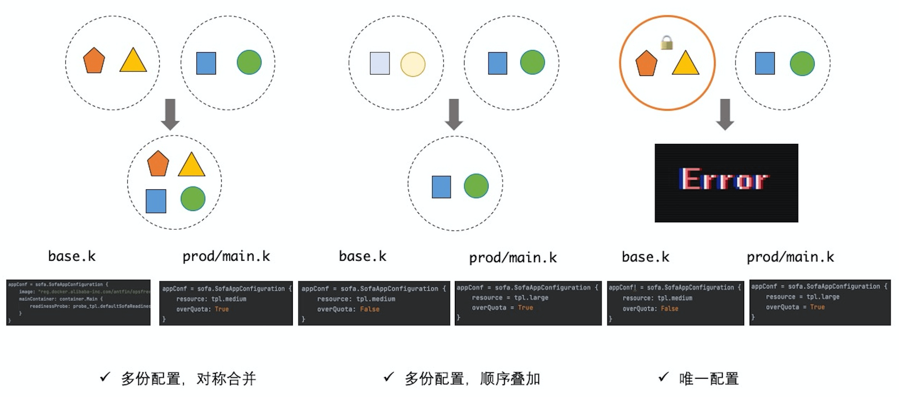

通过场景分析我们对 KCL 有了初步的了解，我们以编程语言的理论、技术，云原生应用场景三方面为输入设计 KCL，我们希望通过简单有效的技术手段支撑平台侧、应用侧完成基础设施描述，将问题尽可能暴露在 KCL 编译、测试阶段，以减少线上运行时的问题频次。此外我们提供了便利的语言能力和工具帮助不同的使用群体更高效的完成其工作，并通过工程化的方式组织、共享代码，对接 Kubernetes API 生态。

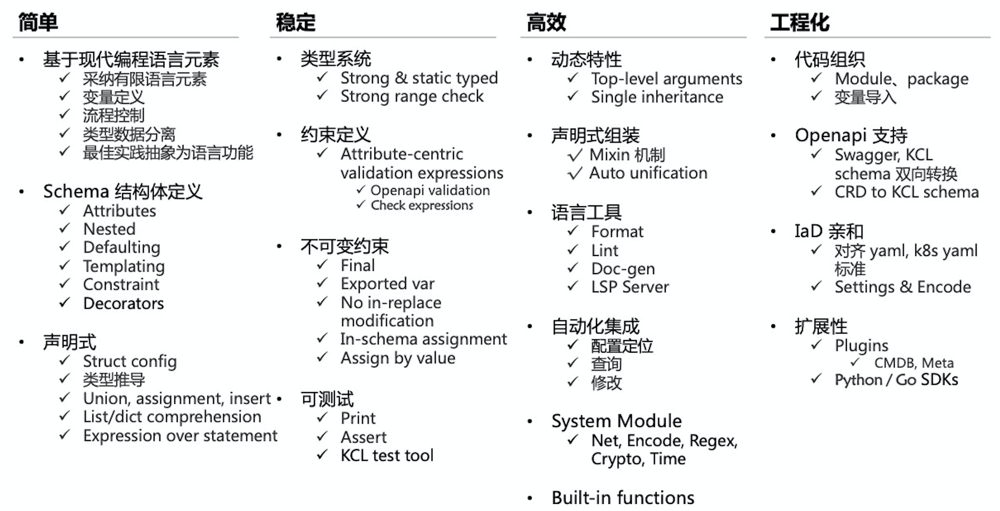

## 5. 抽象模型

通过对 Kusion 落地集成、协同编程场景的分析，我们了解到 Kusion 技术的组成场景及使用方式。我们再来看看 Kusion 关键抽象模型。

我们先来看 KCL 代码的抽象模型。以下图为例，首先 KCL 代码在编译过程中形成两张有向无环图，分别对应结构体内部声明代码及结构体使用声明。编译过程可以简单分为展开、合并、代换三步。通过这样的计算过程，在编译时完成了大部分代换运算，最终运行时进行少量计算即可得到最终的解。在编译过程中，我们同步进行类型检查和值的检查，他们的区别是类型检查是做泛化，取偏序上确界，值检查是做特化，取偏序下确界。 >

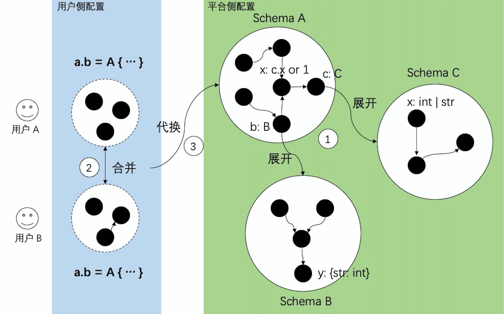

对于 KCLVM 的解释器，我们采用了标准的分层解耦的设计方式，由 parser、compiler、VM 三部分组成。我们希望尽可能的在编译时完成工作，例如图的展开、代换，类型的检查、推导等，这样可以保持 VM 部分尽可能简单。后续我们将在 KCLVM compiler 中支持对 WASM 中间表示的编译支持。此外我们通过 plugin 机制支持对 VM 运行时能力的扩展，并考虑了对 LSP Server 的支持以降低 IDE、编辑器支持成本。

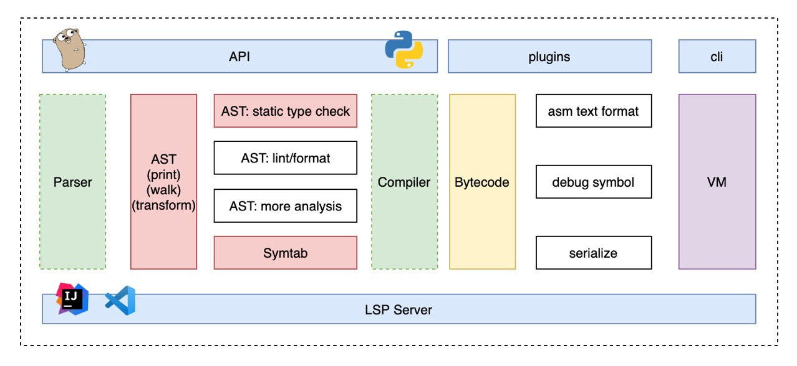

在工程化方面，我们通过 project、stack、component 三级方式组织 KCL 代码。当代码映射到 Kubernetes 集群时，Kusion 支持两种映射方式。

第一种方式支持将 stack 映射为 namespace，component 在 namespace 内存在，即 stack 内共享资源配额，component 间通过 SDN 及 Mesh 能力做隔离，这是社区比较常见的一种实践方式。

第二种方式将 component 映射为 namespace，stack 通过 label 标识，通过 SA 管理权限，资源配额定义在 component 维度，component 间通过 namespace 的隔离能力做隔离，这是蚂蚁目前线上环境的实践方式。无论如何映射，用户无需感知物理集群对接及切换细节。此外，KCL 代码中资源定义都可以通过唯一的资源 ID 定位，这也是对代码进行“增删改查”的基础。

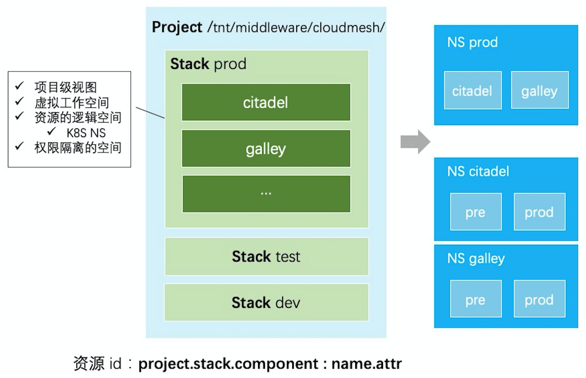

为了支持上述的隔离及映射逻辑，我们提供了 KusionCtl 工具帮助用户完成项目结构初始化、Kubernetes 集群映射、执行状态跟踪及展示、Identity 权限集成等常用功能。用户可以通过 KusionCtl 完成研发、测试环境的执行和验证工作。

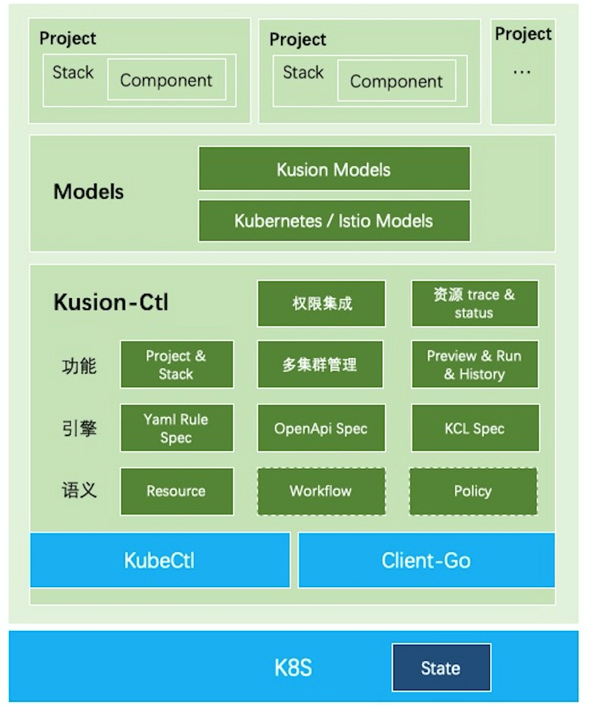

对于线上环境，我们更推荐使用基于 Kusion 的运维产品进行变更操作。我们希望通过 KCL 代码开放、透明、声明式、意图导向、分层解耦的定义基础设施，本质上是面向数据及其约束的一种协同工作，变更是一种数据的流动。我们通过前置的预编译、计算、验证，最终将数据交付到各环境的运行时，相比于经典命令式系统中计算逻辑流动的方式，可以最大程度避免复杂命令式计算造成的运行时数据错误，特别是当计算逻辑发生变更时，这种运行时计算错误的结果通常都是一次线上故障。

最后，我们来看一种 Kusion 思路的技术架构，我们仍然以控制器、业务层、编排层、任务及管道的分层逻辑来看。自下而上的，由 Kubernetes API Server 收敛了管道并提供了原生资源定义，并通过 CRD & Operator 进行扩展提供稳定的原子任务定义。从我个人的角度看，Operator 如其名约“操作员”，重复着接收订单、执行操作的简单循环，订单未完成则持续操作。

Operator 应尽可能保持简单，避免复杂的业务逻辑拆解、控制逻辑、状态机，同时避免因为微小的差异创建新的 Operator 或通过 Operator 做单纯的数据、YAML 转换。Operator 作为收敛基础设施原子能力的存在，应尽量内聚、稳定。在业务层、编排层，我们通过 KCL 代码在 Konfig 仓库中编写，并结合 GitOps 支持应用粒度的变更、编译、测试、验证。控制器层高度引擎化，聚焦自动化逻辑，根据业务场景需要定制控制器及 GUI 产品界面。应用的配置代码“组件”由多个控制器共享复用，例如建站、发布、部分运维都将依赖应用 AppConfiguration 配置代码块。

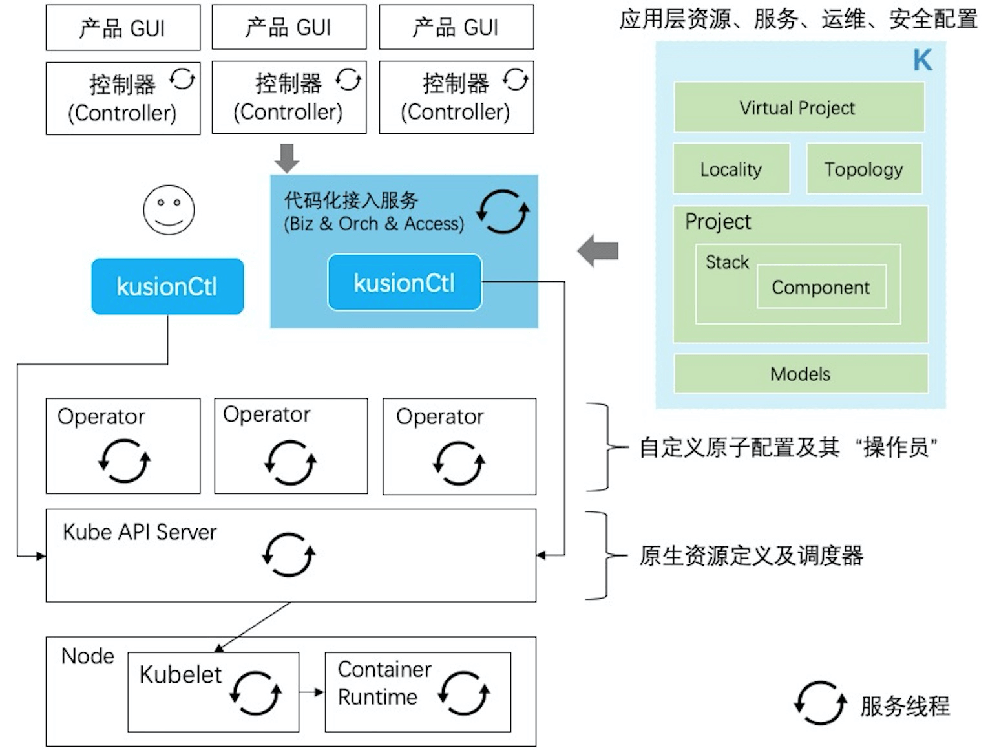

## 6. 总结 & 展望

最后，我们对开放协同技术工作做一个总结。

我们常说 Kubernetes 是云计算的 Linux/Unix，相比于 Unix 丰富的外围配套生态，Kubernetes 在配套技术能力上还有很长的路径。对比于使用便利的 Shell、Tools，我们还缺少一种符合 Kubernetes 声明式、开放、共享设计理念的语言及工具，Kusion 希望能在这一领域有所帮助，提升基础设施的开放程度及使用效率，易于共享、协同，提升稳定性，简化云原生技术设施的接入方式。

我们的探索和实践仍然在一个初级阶段，我们希望通过 Kusion 的技术和服务能力在运维、可信、云原生架构演进方面起到积极的作用。

我们希望推进真正的基础设施代码化，促成跨团队的 DevOps，成为持续部署与运维的技术支撑。在可信方面，策略及代码、可信集成、标准化的支撑是我们后续的工作重点之一，特别是与策略引擎的结合，是开放可信技术能力的关键步骤。

在云原生架构方面，我们将持续推进架构现代化的演进，通过技术手段支持更多上层自动化产品业务的快速创新，同时通过统一的流程、企业级的技术能力支持服务好基础设施应用场景。

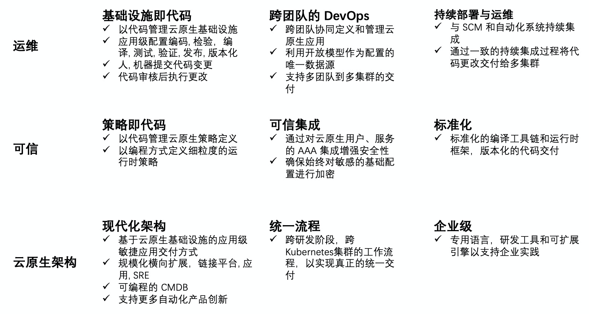

纵观历史，技术总是朝着提高整体社会协作效能演进。 Kusion 带来的云原生开放协同无疑是这条朴素规律再次发挥效力的注脚。