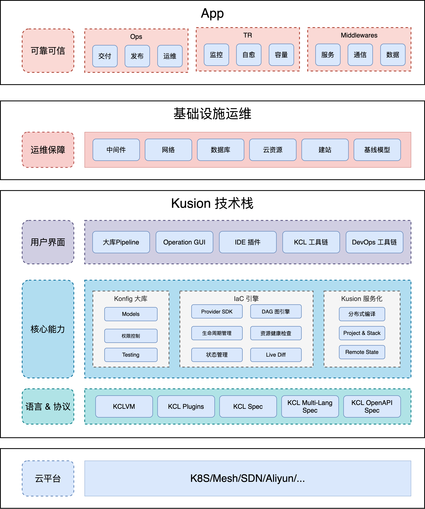
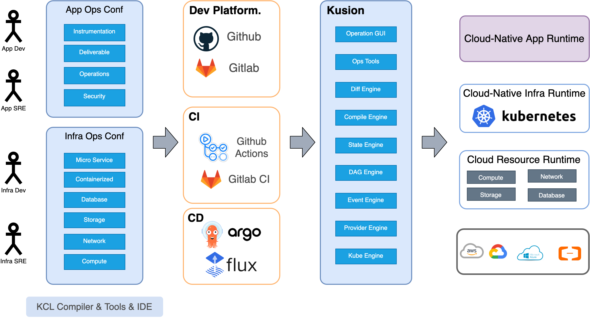

# Kusion 整体架构

架构图本质上反应的是 Kusion 的工作流程和工作机制。熟悉了整体架构图之后，同样能够做到纲举目张为 Kusion 的日常使用和开发提供指导。

## 1. 架构简图

先从架构简图开始，其中涉及 App 和基础设施如何通过 Kusion 技术栈联通目标平台。如下图所示：

App 和 Infra 的开发人员完整最基础的功能和配置开发，SRE 则基于基础的功能通过完成运维配置代码化工作，然后通过 Kusion 技术栈将运维配置代码转化为不同目标平台的具体操作。

## 2. 架构大图

在架构简图的之上，将 Kusion 面对的具体场景和特性填充到各个子模块中的得到了架构大图。Kusion 开源可编程协议栈处于云原生应用到 K8S 平台中间层，上面承接基础设施运维和 App 业务功能、下面对接 K8S 等云平台。Kusion 的架构大图如下：

Kusion 可编程协议栈内部又分为用户界面、核心能力、配置语言等部分。其中用户界面主要面试上层的云原生应用的用户，通过 Kusion 提供的 Konfig 大库自动集成 Pipeline、Operation 操作界面、VSCode 的插件和相关的命令行工具等，和内部的 Kusion 模型库、IaC 引擎和 Kusion 服务等进行能力对接。最下面的是 KCL 配置策略语言，以及和 KCL 语言相关的语言插件、其他高级语言的 SDK 和其他 OpenAPI 风格的配置数据对接等，语言和协议层为上面的 Konfig 大库提供编程能力、为 IaC 引擎提供可被编程的 SDK 能力等。

## 3. 和上游下游的关系

Kusion 属于云原生运维、基础设施管理、领域编程语言及编译器开源领域。Kusion 涉及的上下游相关项目有：Kubernetes 自身及生态技术
、Kubenetes 运维自动化技术、GitOps CICD 系统、IaaS 管理技术及各个云厂商和 IaC 领域语言及数据格式等。
