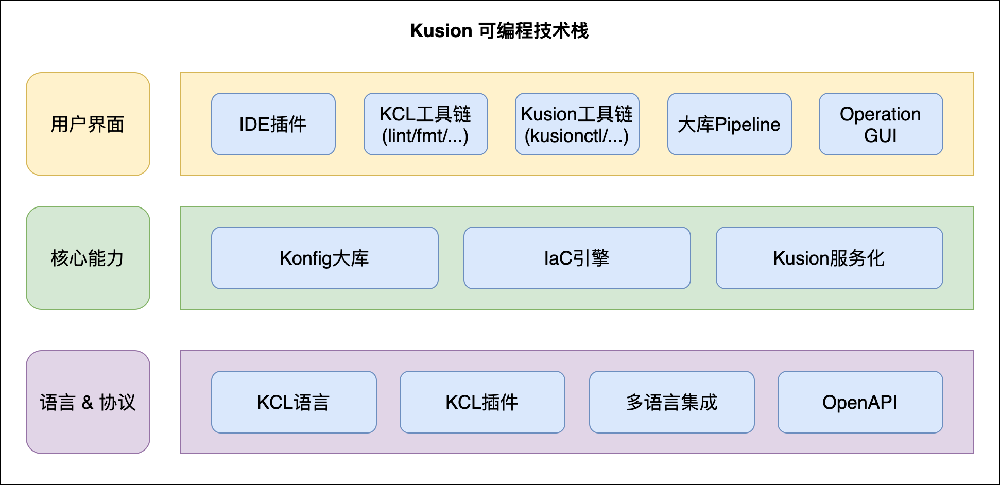
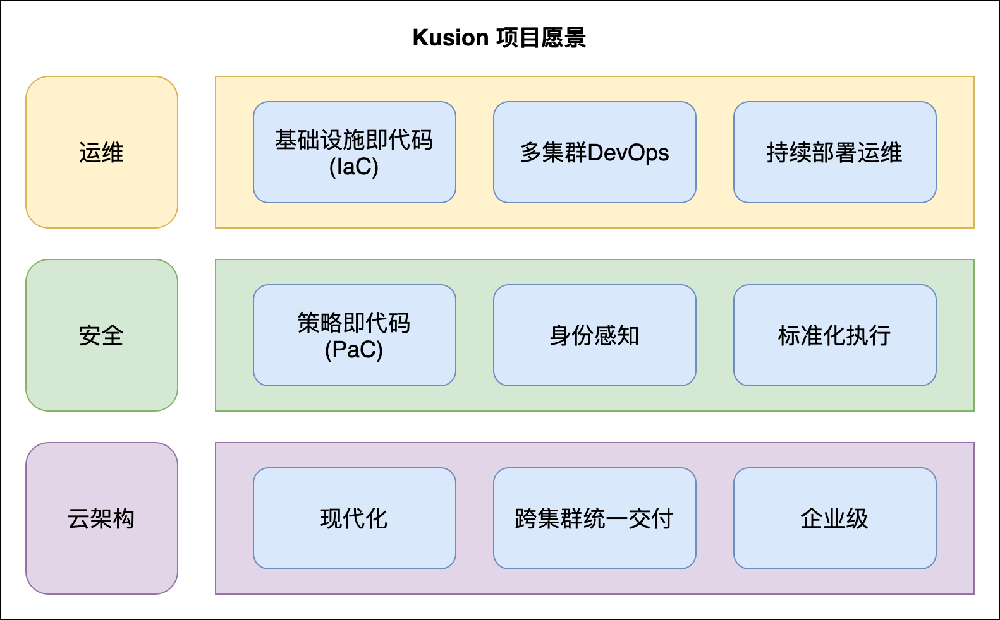

# KusionStack 简介

## 1. KusionStack 是什么

**KusionStack 是开源的可编程云原生协议栈！**

KusionStack 中的 Kusion 一词来源于 fusion（意为融合） + kubernetes，是基于云原生基础设施，通过定义云原生可编程接入层，提供包括配置语言、模型界面、自动化工具、最佳实践在内的一整套解决方案，连通云原生基础设施与业务应用，连接定义和使用基础设施的各个团队，串联应用生命周期的研发、测试、集成、发布各个阶段，服务于云原生自动化系统建设，加速云原生落地。

## 2. 为什么开发 Kusion

目前 K8S 已经是云计算的唯一操作系统，提供了运维更加友好的声明式 API，是云原生应用的标准底座。但是目前的很多基础设施还是通过原始数据的方式描述(IaD)，原始数据数据不适合大规模的协同开发，因此希望通过将基础设施从数据化到代码化(IaC)的方式、通过引入编程领域更为成熟、安全、高效的工作流为运维工作提效。

云原生的思路是高度的开放化和民主化，需要做到万物(比如 Resource、Action、Permission 等)皆可配置。不过目前 K8S 尚缺少功能完备的 SHELL 交互界面(IaD)，而且开源方案相对比较单薄无法满足企业大规模工程化、效率和复杂化的要求，对于跨项目和跨组织的协同也缺少很好的支持。因为云原生应用到 K8S 平台中间层的缺失导致上层的业务落地到 K8S 有困难，Kusion 的目标是弥补这个 Gap 为云原生之上的运维提供技术抓手。

## 3. Kusion 技术栈的组成

Kusion 可编程云原生协议栈的终极目标是为了解决自动化运维：SRE 用户只需要通过 KCL 语言 +Konfig 大库描述自己的业务终态，Kusion 服务引擎通过实时监控系统状态根据描述的状态响应不同规则自动进行定制化的运维操作。

Kusion 技术栈在不同层次提供了相应的工具集、服务框架和规范，如图所示：

在最下层通过面向云原生领域提供定制的 KCL 配置策略语言、语言插件、多语言 SDK 和 OCMP 指导规范等手段为 云原生应用 IaC 化提供最基础的工具和实践指南。中间层通过 Konfig 大库、IaC 引擎、Kusion 服务为上层云原生应用提供随时可用的模型框架、配套的服务和工具。上层的 SRE 用户则通过 Kusion 提供的 Kusion 模型库描述终态，通过 Kusion 命令行工具进行查看仓库和线上系统差异，然后通过脚本进行半自动化运维工作。通过结合最佳的实践和 CICD 系统提供的辅助能力到 Kusion 工具链，可以极大简化多集群集成、权限系统集成、风险系统集成等系统化运维等工作。

## 4. Kusion 项目愿景

下面是 Kusion 的项目愿景大图：

愿景目标解释：

- 运维
  - 基础设施即代码(IaC)
    - 管理云 app 和 基础设施
    - 创建、计划、应用和版本管理
    - 可通过代码追溯和审计变更
  - 多集群 DevOps
    - 跨团队协作定义和管理云上的应用程序
    - 开放模型是唯一的描述源
    - 赋能多集群的跨团队合作
  - 持续部署运维
    - 持续与 SCM 和自动化系统集成
    - 统一的工作流程代码交付多集群
- 安全
  - 策略即代码(PaC)
    - 云基础设施的管理策略以代码形式创建
    - 通过编程手段针对运行时构建细粒度的策略
  - 身份感知
    - 通过管理云上用户和服务的“AAA” 来增强安全性
    - 确保基础设施的敏感配置全程加密
  - 标准化执行
    - 使用标准技术、编码规范、代码组织规范，实现版本和补丁标准化管理
- 云架构
  - 现代化
    - 现代化的容器和微服务架构实现跨基础设施、跨应用的 DevOps
  - 跨集群统一交付
    - 跨所有开发阶段、 Kubernetes 集群、多基础设施、多云平台的一致的工作流程，实现真正的统一交付
  - 企业级
    - 针对企业需求，通过语言、开发工具和可扩展的引擎提供强大的安全和运维实践

Kusion 希望在 运维、安全、云架构 几个方向为云原生应用的快速落地提供必要的帮助。
